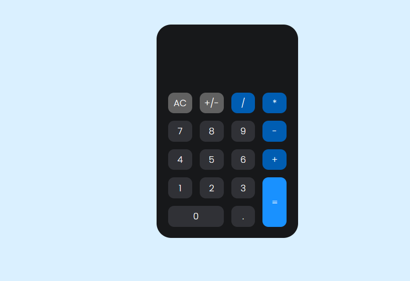

<h1 align="center">  Calculadora </h1>

Projeto Calculadora

  <a href="#-tecnologias">Tecnologias</a>&nbsp;&nbsp;&nbsp;|&nbsp;&nbsp;&nbsp;
  <a href="#-projeto">Projeto</a>&nbsp;&nbsp;&nbsp;|&nbsp;&nbsp;&nbsp;
  <a href="#-layout">Layout</a>&nbsp;&nbsp;&nbsp;|&nbsp;&nbsp;&nbsp;
  <a href="#memo-licença">Licença</a>

  

 

  

## 🚀 Tecnologias

Esse projeto foi desenvolvido com as seguintes tecnologias:

- HTML e CSS
-JavaScript
- Git e Github

## 💻 Projeto

Uma tela de celular com quatro redes sociais e um botão home onde ao clicar aparece na tela de navegação com link para acessar.

<!--## 🔖 Layout-->